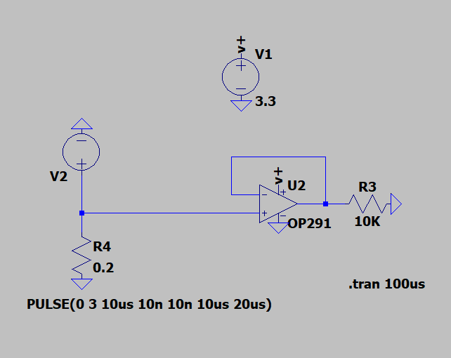
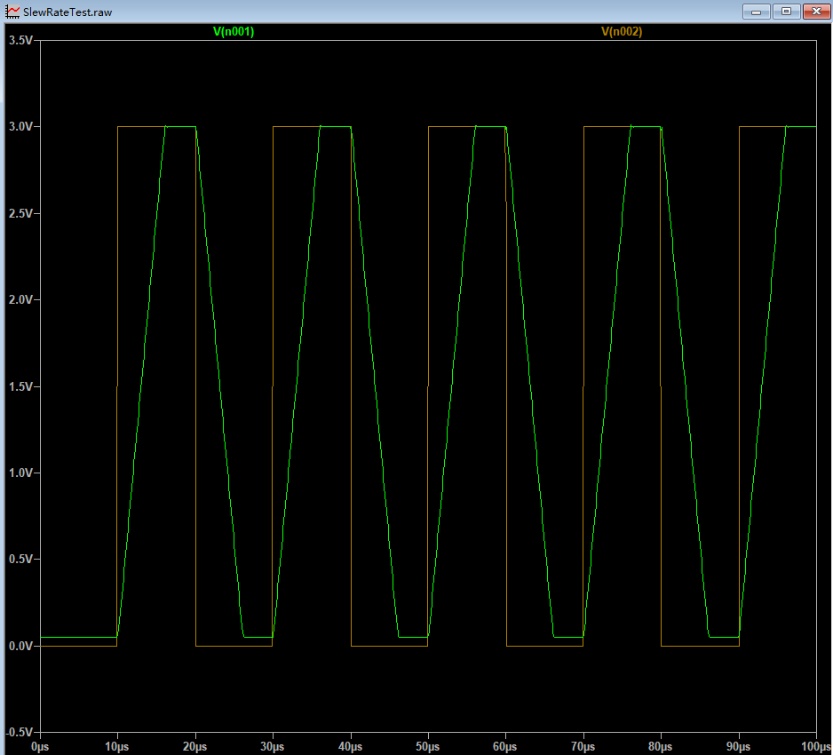

# 1 前提
+ 使用ADI的OP291测试压摆率
+ 使用ADI的LTspice（version 26.0.2）进行测试
    + 3V 供电时，压摆率为 **0.4 V/μs**
    + 5V供电时，压摆率为 **0.5V/μs**

# 2 测试电路

+ 输入信号
    + 0V低电平、3V高电平
    + 周期20us，占空比50%的方波
    + 上升、下降时间均为10ns
+ 运放
    + 输出跟随输入

# 3 波形

+ 上图中黄色为输入信号
+ 绿色为输出信号
    + 由于当前运放输出不是轨到轨，因此输出低电平时有一定的电压偏移

+ 理想情况：
    + 输出电压需要在10ns内完成电平跳变
+ 实际情况
    + 按**0.5V/μs**的压摆率计算
    + 3 / 0.5 = 6us
    + 输出的电平，需要经过6秒，才能完成跳变过程
