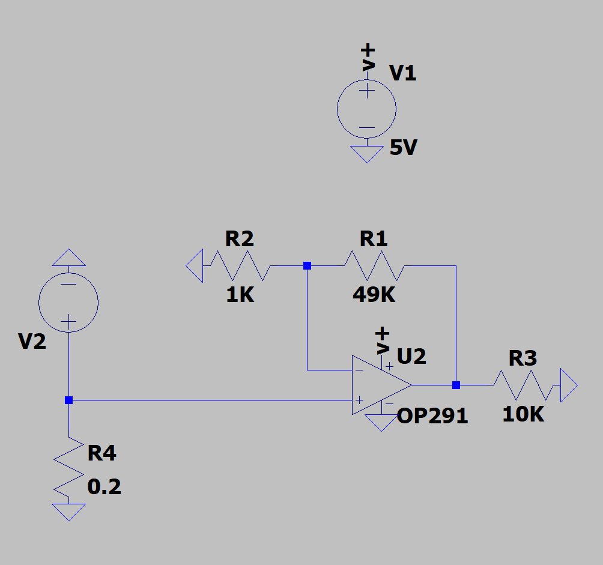
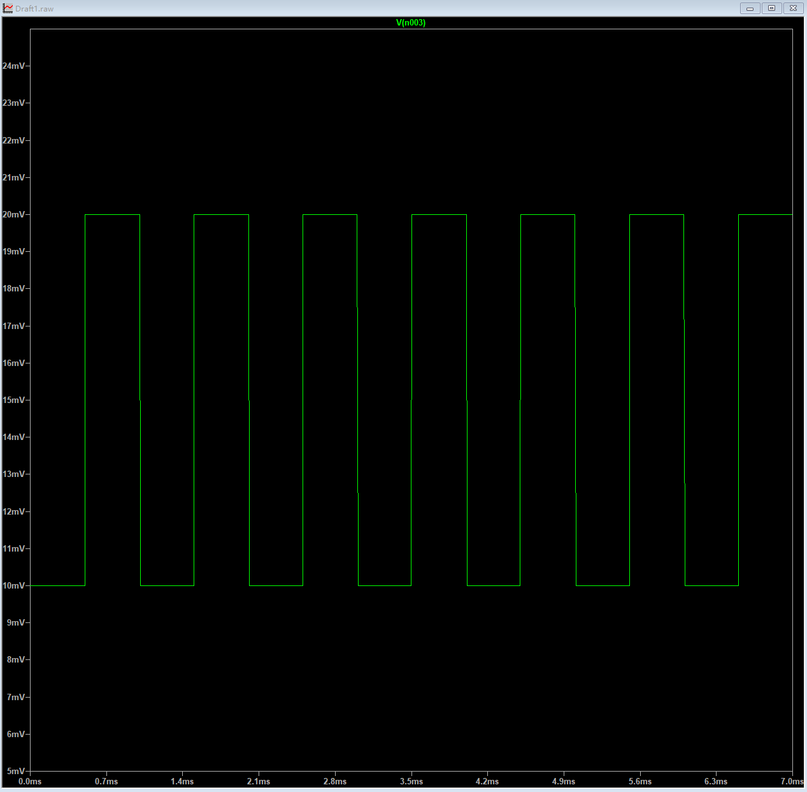
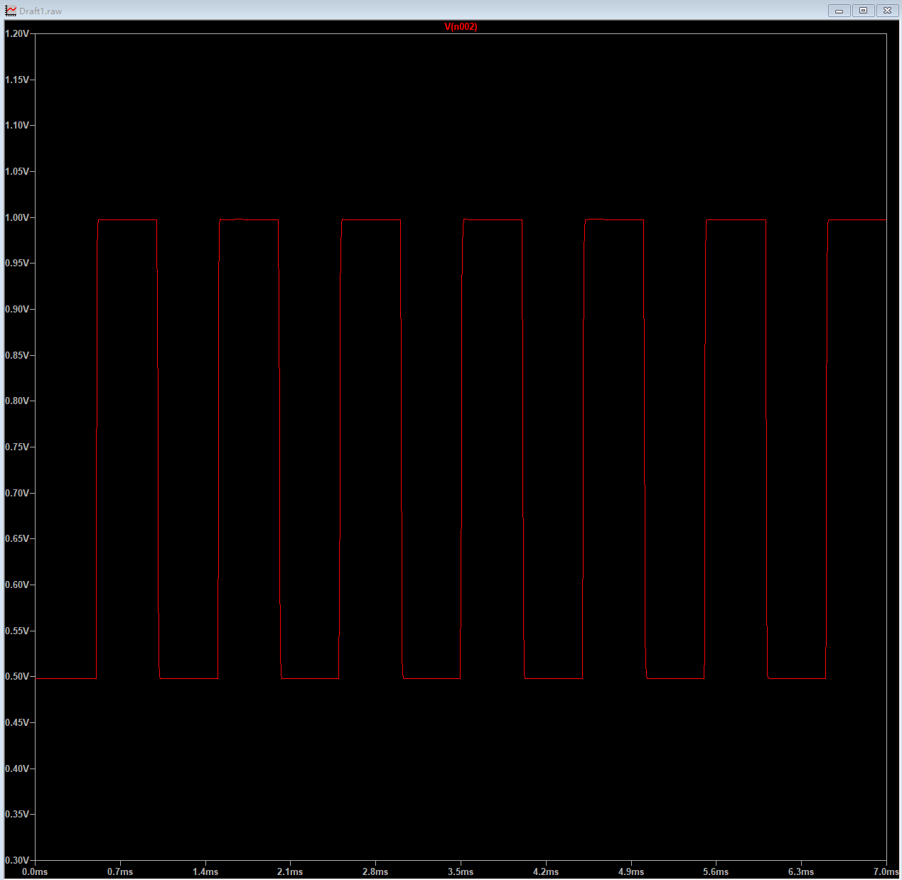
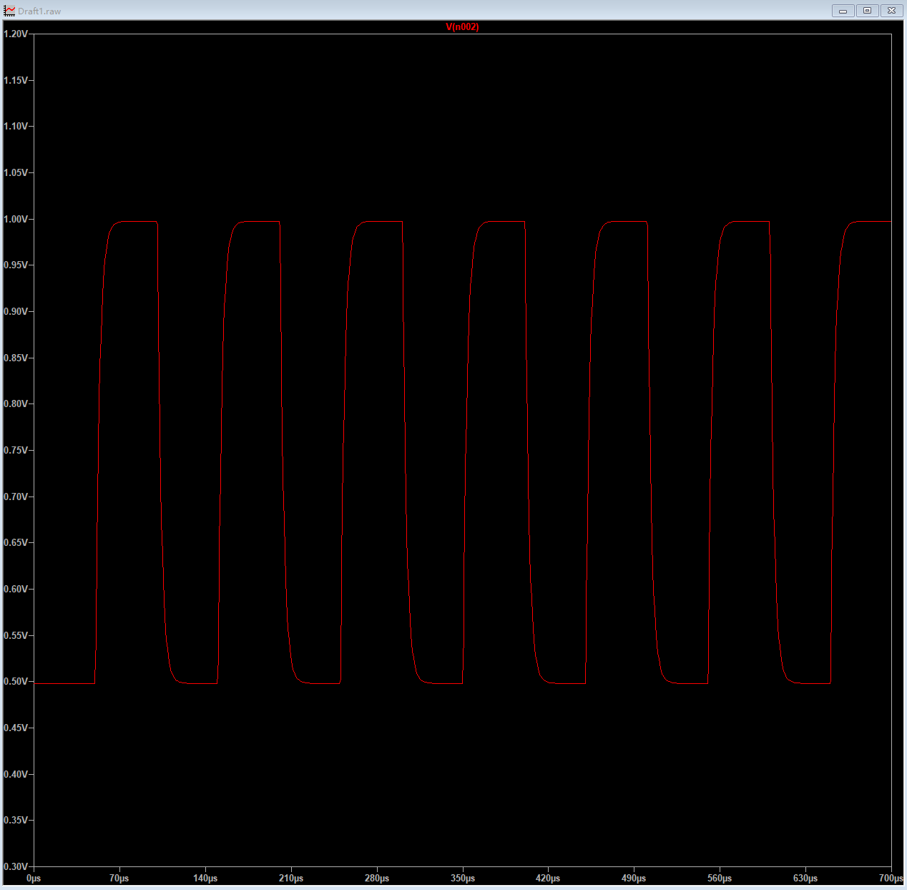
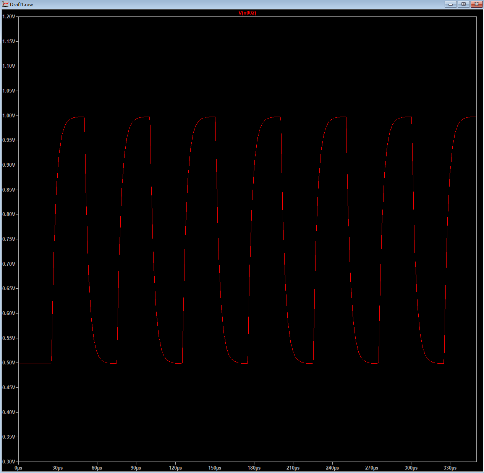
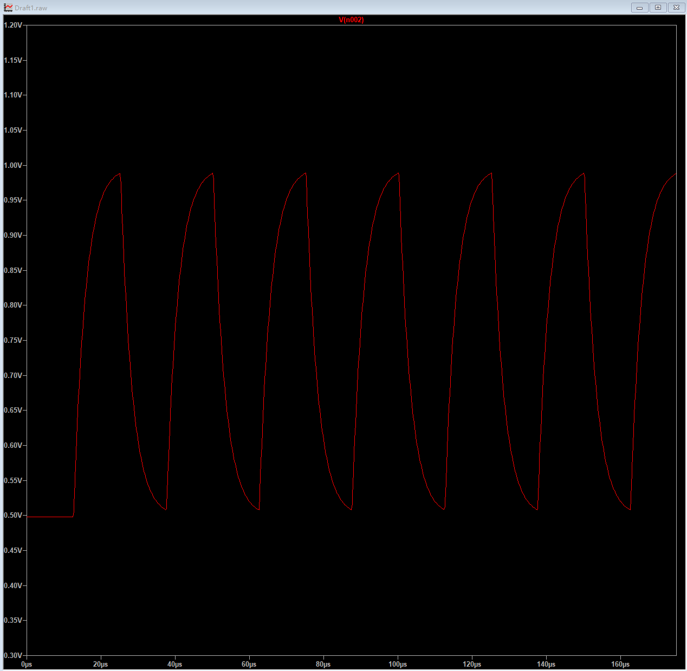
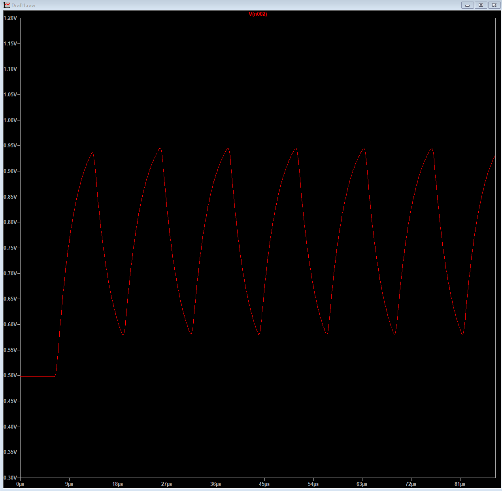

# 1 前提
+ 使用ADI的OP291测试压摆率
+ 使用ADI的LTspice（version 26.0.2）进行测试
    + 增益带宽积（GBW）： **3 MHz**

# 2 测试电路

+ 放大50倍
+ 方波通过R4上端输入
+ 后续一律测量R4上端、R3左侧电压波形

+ 输入波形：方波
    + 低电压10mV，高电压20mV
    + PWM一律50%
    + 上升、下降时间，均为周期的0.5%
    + 输入不同周期的信号，观察输出信号波形
+ 增益：50倍
    + 对应带宽60KHz

# 3 波形
## 3.1 输入波形

+ 仅为示例，参数如之前所述
+ 后续不再截取

## 3.2 输出波形测量
### 3.2.1 频率：1KHz

### 3.2.2 频率：10KHz，周期100us

### 3.2.3 频率：20KHz，周期50us

### 3.2.4 频率：40KHz，周期25us

### 3.2.5 频率：80KHz

+ 使用60Khz带宽的运放测量80KH的波形
    + 失真严重，完全不可行

