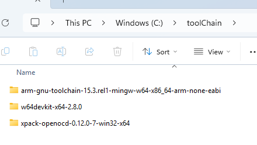
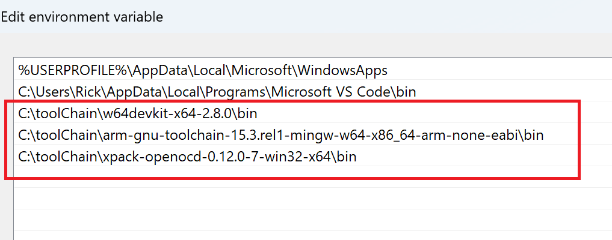

# 1 下载
- 下载minGW-w64devkit：[Releases · skeeto/w64devkit](https://github.com/skeeto/w64devkit/releases)
    - 版本：[w64devkit-x64-2.8.0.7z.exe](https://github.com/skeeto/w64devkit/releases/download/v2.8.0/w64devkit-x64-2.8.0.7z.exe)
- 下载openOCD：[Releases · xpack-dev-tools/openocd-xpack](https://github.com/xpack-dev-tools/openocd-xpack/releases)
    - 版本：[xpack-openocd-0.12.0-7-win32-x64.zip](https://github.com/xpack-dev-tools/openocd-xpack/releases/download/v0.12.0-7/xpack-openocd-0.12.0-7-win32-x64.zip)
- 下载gcc-arm-none-eabi：[Tooling / gnu-toolchains-for-arm · GitLab](https://gitlab.arm.com/tooling/gnu-toolchains-for-arm/-/tree/releases/15.3.rel1?ref_type=heads#windows)
    - 版本：arm-gnu-toolchain-15.3.rel1-mingw-w64-x86_64-arm-none-eabi.zip

# 2 环境设置
- 之前下载的文件均不需要安装
- 按照个人习惯，将文件放到某个路径即可，例如我的保存位置

- 把三个文件都加到环境变量中

