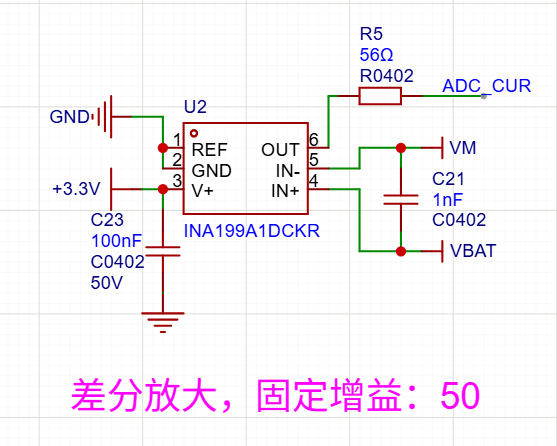

+ CMRR：共模抑制比

# 1 共模抑制比（CMRR）简单理解

+ 理想情况：
$$
    ADC\_CUR = (VBAT - VM) * 50
$$
+ 实际情况
$$
ADC\_CUR = (VBAT - VM) × 50 + 共模误差
$$

+ 共模电压： $共模电压 = (VBAT + VM) / 2$
+ 共模误差：
$$共模噪声 = 共模电压 * 系数 = 共模电压* 10^{-CMRR/20}$$
    
+ 由此确定
    + 电路一致时，共模电压越小，共模噪声越小
    + 电压一致时，运放的`CMRR`越大，共模噪声越小

# 2 如何根据共模抑制比计算输出值
如何根据共模抑制比算误差
+ 假设运放参数共模抑制比：100db
+ 电路参数如下
    + 同相输入端10V
    + 反相输入端9.9V
    + 固定增益50
## 2.1 算差模和共模
+ 差模：
$$V_{diff} = V_{+} - V_{-} = 10 - 9.9 = 0.1 \text{ V} = 100 \text{ mV}$$
+ 共模：
$$V_{cm} = \frac{V_{+} + V_{-}}{2} = \frac{10 + 9.9}{2} = 9.95 \text{ V}$$
## 2.2 算共模泄漏误差

$$V_{error} = \frac{V_{cm}}{10^{CMRR/20}} = \frac{9.95}{10^{100/20}} = \frac{9.95}{10^{5}} = \frac{9.95}{100000} = 99.5 \text{ µV}$$

## 2.3 算输出端各分量

|分量|计算|结果|
|:--|:--|:--|
|理想差模输出|0.1 V×50|5 V|
|共模泄漏输出|99.5 µV×50|4.975 mV|
|实际输出|5 V+4.975 mV|≈5.005 V|

## 2.4 最终误差评估
$$\text{误差比例} = \frac{4.975 \text{ mV}}{5 \text{ V}} \times 100 = 0.0995 \approx 0.1$$
+ 此处 “0.1” 指 “百分之0.1”，暂时没找到一个同时支持`obsidian`和`github`的写法

# 3 根据需求选型
## 3.1 需求
|参数| 数值           |
|:--|:--|
|最大共模电压 Vcm​| 12 V         |
|最小差模信号 Vdiff​| 0.05 V=50 mV |
|允许误差| 1%           |
|差模增益 Adiff​|50|
## 3.2 快速公式

$$CMRR_{required} = 20 \cdot \log_{10}\left(\frac{V_{cm}}{V_{diff} \times \text{允许误差}}\right)$$
+ 带入需求中所列参数
$$CMRR = 20 \cdot \log_{10}\left(\frac{12}{0.05 \times 0.01}\right) = 20 \cdot \log_{10}(24000) \approx 88 \text{ dB}$$

## 3.3 计算
### 3.3.1 允许的共模泄漏（输入端）

$$\text{允许误差电压} = V_{diff} \times 1\% = 50 \text{ mV} \times 0.01 = 0.5 \text{ mV} = 500 \text{ µV}$$
### 3.3.2 反推所需 CMRR

$$CMRR_{required} = 20 \cdot \log_{10}\left(\frac{V_{cm}}{V_{error}}\right) = 20 \cdot \log_{10}\left(\frac{12 \text{ V}}{0.5 \text{ mV}}\right)$$

$$= 20 \cdot \log_{10}\left(\frac{12}{0.0005}\right) = 20 \cdot \log_{10}(24000)$$

$$= 20 \times 4.38 = 87.6 \text{ dB}$$
### 3.3.3 验证输出
|分量|计算|结果|
|:--|:--|:--|
|理想差模输出|50 mV×50|2.5 V|
|共模泄漏输出|0.5 mV×50|25 mV|
|实际输出|2.5 V+25 mV|2.525 V|
|相对误差|25 mV/2.5 V|1% ✅|
